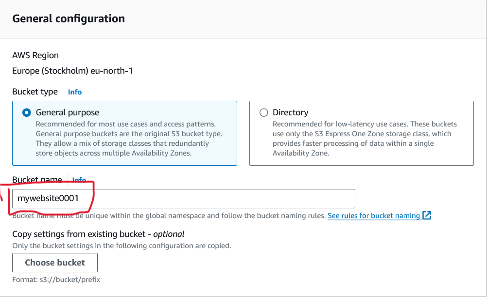

### Deploying-a-Static-Website-on-Amazon-S3
Deploying a static website on aws S3 using cloudFront

1. ## Create a bucket
   * Give a unique name for the bucket
   * AWS recommends > For Region, we recommend choosing an AWS Region that is geographically close to you. (This reduces latency and costs.)
   
   
2. ## Upload the your website files
   - Click on your bucket to open
   - Click on Upload to start the process of uploding 
   - below "Destination" tick Grand public-read-access: to allow access of our website
   - Finally click on upload to upload the files

   Go to your bucket properties; enable the "**Static website hosting**" and specify "index.html" like **index document**

Select the files and click on **Action**; click on **make public using ACL**

 **You can your website url in your bucket properties then scroll to the bottom**
 My Website is now available

 

# CloudFront Distribution Setup

## 1. Access and Create Distribution

1. **Access CloudFront**:  
   In the AWS Management Console, navigate to the CloudFront service.  
   

2. **Create a New Distribution**:  
   Click on `Create Distribution` and choose the `Web` option for distribution.

   

---

## 2. Configure Origin and Viewer Settings

1. **Origin Domain Name**:  
   Select your S3 bucket from the dropdown list in the origin configuration section.

2. **Origin Path (Optional)**:  
   If you want to restrict access to specific content, specify the path within your S3 bucket.

3. **Viewer Protocol Policy**:  
   Choose whether to allow both HTTP and HTTPS or enforce a redirect from HTTP to HTTPS for secure content delivery.

---

## 3. Configure and Deploy the Distribution

1. **Cache Behavior Settings**:  
   Adjust how CloudFront caches content, including request handling and object caching duration.  

2. **Distribution Settings**:  
   Choose your pricing class, add alternate domain names (CNAMEs) if needed, and configure SSL certificates for custom domains.

3. **Review and Deploy**:  
   After reviewing your settings, click `Create Distribution`. Deployment may take some time. Once complete, you'll receive a CloudFront domain name.

   

   When you click on your CloudFront distribution, you can copy your website url which is **Distribution Domain Name**

   
   
 My website is now available with cloudFrond

 
